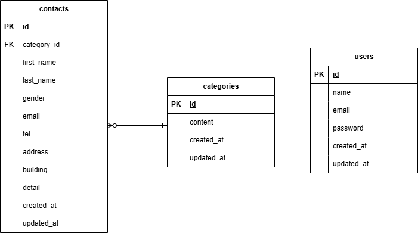

# お問い合わせフォーム

## 環境構築

### Docker ビルド

1. `git clone git@github.com:seki0603/contact-form-test.git`
2. cd contact-form-test
3. mkdir docker/mysql/data
4. docker-compose up -d --build

＊MySQL は、OS によって起動しない場合があるのでそれぞれの PC に合わせて docker-compose.yml ファイルを編集してください。
<br>

### Laravel 環境構築

1. docker-compose exec php bash
2. composer install
3. .env.example ファイルから.env を作成し、環境変数を変更
4. php artisan key:generate
5. php artisan migrate
6. php artisan db:seed
   <br>

## 使用技術

- PHP 8.1.3
- Laravel 8.83.29
- MySQL 8.0.26
  <br>

## ER 図



## 補足事項

- Users テーブルは他のテーブルとリレーションを持たないため独立。
* 機能確認用にUsersテーブルへダミーユーザーをシーダーで作成しています。  
  ログイン情報は以下の通りです。
```
Email: coachtech@example.com
Password: coachtech
```
- csv エクスポート機能のみ、使用用途を考慮し、ID を表示しています。

## URL

- 開発環境：http://localhost/
- phpMyAdmin：http://localhost:8080/

## 補足事項

- Users テーブルは他のテーブルとリレーションを持たないため独立。
- 機能確認用に Users テーブルへダミーユーザーをシーダーで作成しています。  
  ログイン情報は以下の通りです。  

